   
---    

# SVD

## 原理

&#160; &#160; &#160; &#160;
SVD的想法是根据已有的评分情况，分析出评分者对各个因子的喜好程度以及电影包含各个因子的程度，然后再反过来根据分析结果对未知评分进行预测。

&#160; &#160; &#160; &#160;
以如下一个稀疏的评分矩阵为例。其中，行标代表不同的电影，列标代表了用户，每个元素代表某个用户对某个电影的打分，以问好形式出现的就是未知的评分。SVD算法就是要利用已知的评分数据去对未知评分进行预测。

<div  align="center">    
  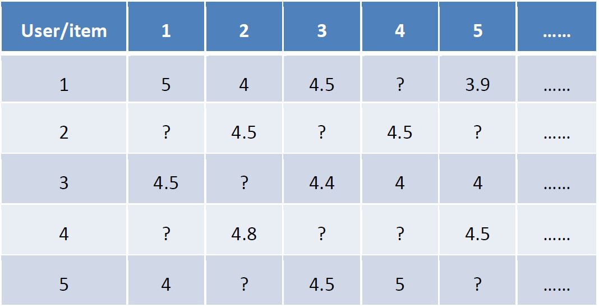
</div>

&#160; &#160; &#160; &#160;
由于对任意的一个m×n的矩阵，都可进行满秩分解成m×k和k×n的矩阵。因此如图所示的评分矩阵，也存在这样一个分解。不妨把评分矩阵记为R。则
$$
  R_{U\times I} = P_{U\times K}Q_{K\times I}
$$

上述中的k是隐性因子，它代表了影片的某种性质。

&#160; &#160; &#160; &#160;
故用户对电影的喜好，即评分值，可以表示成用户特征向量和电影特征向量对应项的乘积的和，即内积。

<div  align="center">    
  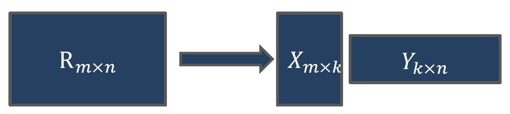
</div>

形式化地，预测函数，即第u个用户对第i部电影的评分可写作：$\hat{r_{ui}}=p_{u}^\mathrm{T}q_{i}$。设已知的评分为$r_{ui}$ ，则真实值与预测值的误差$e_{ui}=r_{ui}-\hat{r_{ui}}$。 故可以计算出总的误差评分$SSE=\sum_{u,i}e_{ui}^{2}=\sum_{u,i}(r_{ui}-\sum_{k=1}^{K}p_{uk}q_{ki})^{2}$。为了让P、Q最好的拟合R，需通过训练来把SSE降到最小。

为求解这个最小二乘问题，现使用随机梯度下降法。

求目标函数SSE在$p_{uk}$变量处的梯度：

$$
\frac{\partial}{\partial p_{uk}}SSE=\frac{\partial}{\partial p_{uk}}e_{ui}^{2}=2e_{ui}\frac{\partial}{\partial p_{uk}}e_{ui}
$$
    
由于

$$
e_{ui}=r_{ui}-\hat{r_{ui}}=r_{ui}-p_{u}^\mathrm{T}q_{i}=r_{ui}-\sum_{k=1}^{K}p_{uk}q_{ki}
$$

则
$$
  \frac{\partial}{\partial p_{uk}}e_{ui}=\frac{\partial}{\partial p_{uk}}\left(r_{ui}-\sum_{k=1}^{K}p_{uk}q_{ki}\right)=-q_{ki}
$$
$$
 \frac{\partial}{\partial p_{uk}}SSE=\frac{\partial}{\partial p_{uk}}e_{ui}^{2}=-2e_{ui}q_{ki}
$$

由于系数不影响结果，因而可得负梯度搜索方向$\frac{\partial}{\partial p_{uk}}SSE=-e_{ui}q_{ki}$。

令更新的步长，即学习速率为n，则$p_{uk}$，$q_{ki}$的更新式为
$$
  p_{uk}=p_{uk}+ne_{ui}q_{ki} \quad \quad q_{ki}=q_{ki}+ne_{ui}q_{uk}
$$

&#160; &#160; &#160; &#160;
需要说明的是，除了可以用随机梯度下降来进行更新外，还可以用批梯度下降法。但由于批梯度下降是计算完所有已知评分的预测误差后再对P、Q进行更新，即要在下一轮迭代才能使用本次迭代的值。而随机梯度下降是每计算完一个$e_{ui}$就进行更新，这样的随机性有利于避免局部最优解。

&#160; &#160; &#160; &#160;
故具体来说，这样不断的迭代，重复直到均方根函数RMSE收敛即可得到两个完整的矩阵P、Q来拟合R，SVD算法也就达到了去预测未知评分的目的。

## RSVD
&#160; &#160; &#160; &#160;
由于此训练针对评分数据，当隐形因子k很多、矩阵很稀疏，提供的有效信息很少，从而SVD很容易出现过拟合的情况。为了避免过拟合情况的发生，需在目标函数中加入正则化参数，对P、Q矩阵所有的变量都进行惩罚。则目标函数变为：
$$
SSE = \frac{1}{2}\sum_{u,i}e_{ui}^{2}=\frac{1}{2}\lambda\sum_{u}\vert p_{u} \vert^{2}+\frac{1}{2}\lambda\sum_{u}\vert q_{i} \vert^{2}
$$
同样使用梯度下降法求目标函数的最小值。则
$$
\frac{\partial}{\partial p_{uk}}SSE=-e_{ui}q_{ki}+\lambda p_{uk}
$$
$$
\frac{\partial}{\partial p_{uk}}SSE=-e_{ui}p_{uk}+\lambda q_{ik}
$$
将这两个变量往负梯度方向变化，故更新式为
$$
p_{uk}=p_{uk}+n(e_{ui}q_{ki}-\lambda p_{uk})
$$
$$
p_{uk}=p_{uk}+n(e_{ui}q_{ki}-\lambda p_{uk})
$$
这个改进的SVD算法就是正则化的SVD，即RSVD。

## R语言实现

在这里我们使用recommenderlab包来完成推荐模型评价,ggplot2包画图，MovieLense作为数据集。
```{r,message=FALSE}
library(recommenderlab)
library(ggplot2)
data(MovieLense)
MovieLense

```
```{r,collapse=TRUE,fig.align='center'}
image(MovieLense,main = "raw ratings")

```


对MoiveLense数据集做一些基本的统计与可视化。
```{r,collapse=TRUE}
summary(getRatings(MovieLense))

```

```{r,collapse=TRUE,fig.width=4,fig.height=4,fig.align='center'}
qplot(getRatings(MovieLense),binwidth=1,main="Histogram of ratings",xlab="Rating")
```

发现图像具有左偏态，考虑一下标准化（采用Z-score）。
```{r,collapse=TRUE,fig.width=4,fig.height=4,fig.align='center'}
qplot(getRatings(normalize(MovieLense,method="Z-score")),binwidth=1,main="Histogram of normalized ratings",xlab="Rating")
summary(getRatings(normalize(MovieLense,method="Z-score")))
```
那么，平均每人评分了多少部电影呢？
```{r,collapse=TRUE,fig.width=4,fig.height=4,fig.align='center'}
qplot(rowCounts(MovieLense),binwidth=10,main="Movies rated on average",
xlab="# of users",ylab="# of movies rated")
```
再看一看每部电影的平均得分。
```{r,collapse=TRUE,fig.width=4,fig.height=4,fig.align='center'}
qplot(colMeans(MovieLense),binwidth=.1,main="mean rating of Movies",xlab="Rating",ylab="# of movies")
```
采用Simon Fuck采用的随机梯度下降法（stochastic gradient descent optimization）对SSE进行最小化。
```{r,collapse=TRUE}
train <- as(MovieLense[1:100], "matrix")
fsvd <- funkSVD(train, verbose = TRUE)
```
```{r,collapse=TRUE}
### reconstruct the rating matrix as R = UV'
### and calculate the root mean square error on the known ratings
r <- tcrossprod(fsvd$U, fsvd$V)
RMSE(train, r)
```
```{r,collapse=TRUE}
### fold in new users for matrix completion
test <- as(MovieLense[101:105], "matrix")
p <- predict(fsvd, test, verbose = TRUE)
```
```{r,collapse=TRUE}
RMSE(test, p)
```
# Restricted Boltzmann Machines

## RBM的基本结构

&#160; &#160; &#160; &#160;
在2007年的netflix prize大赛上，受限玻尔兹曼机\cite{aa}这种算法大展身手。本质上讲RBM是由可视层和隐藏层相互连接的一个完全二分图网络结构，如下图所示，每一个神经元是一个二值单元，也就是每一个神经元的取值只能等于0或1。

<div  align="center">    
  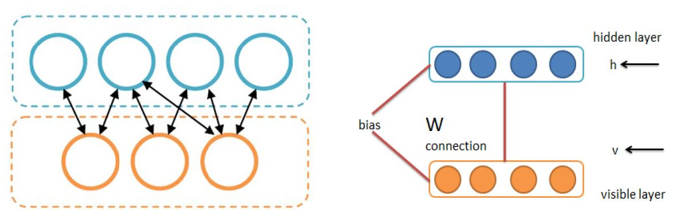
</div>

&#160; &#160; &#160; &#160;
与普通的玻尔兹曼机的不同点在于，RBM强调了“受限”一词，RBM的网络结构具有这样的特点： 可视层的每一个神经元与隐藏层的每一个神经元相互连接；可视层神经元之间，隐藏层神经元之间没有连线，这为我们后面的训练提供了一个很好的假设性条件：同一层的各神经元之间是相互独立的。

&#160; &#160; &#160; &#160;
那如何把RBM运用到netflix的电影评分系统中去呢？RBM本质上是一个编码解码器，具体来说，通过RBM，我们可以把原始输入数据通过激活函数从可视层映射到隐藏层，得到原始输入数据的隐因子（latent factor）向量表示，这一过程也称为编码过程；然后利用得到的隐藏层向量重新映射回可视层，得到新的可视层数据，这个过程称为解码过程。我们的目标是让解码后的结果能和原始数据尽量接近，在此就是用RMSE来衡量的。这样，在解码的过程中，我们不但能得到已评分电影的新的评分数据，还能对未评分的电影的得分进行预测，这些未评分电影的分数从高到低的排序形成推荐列表。

<div  align="center">    
  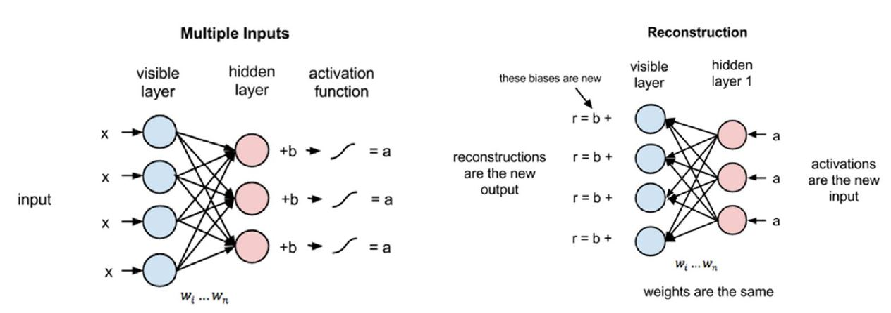
</div>

## RBM在Netflix中的拓展模型

&#160; &#160; &#160; &#160;
在2007年的《Restricted Boltzmann Machines for collaborative filtering》一文中给出了对原始RBM的扩展模型，可视层的每一个神经元分别代表一个电影的评分，每个神经元有k个softmax单元，分别代表1到k分。如果某个电影的评价是三分，相对应神经元第三个softmax单元取值为1，其余取0。missing对应的神经元表示没有看过该电影。当我们训练模型时并不考虑这些missing的神经元。

&#160; &#160; &#160; &#160;
假设一个用户评价了m部电影，令V成为一个$K\times m$的零一变量矩阵，$v_{i}^{k}=1$（用户对第i部电影评分为k，则$v_{i}^{k}$为1，否则为0）。$h_{j}$,$j=1……F$,代表着隐藏层的零一变量。隐藏节点是这些电影的一种抽象特征，例如可以是这些电影的分类类别信息。$W=(w_{ij})$代表着隐藏层和可视层之间的权重矩阵，$w_{ij}$代表可视层第i个神经元与隐藏层第j个神经元的连接权重(随机初始化)。$b_{i}^{k}$代表对电影i评分为k单元的偏移向量参数，$b_{j}$代表第j个隐藏层神经元的偏移向量参数。

<div  align="center">    
  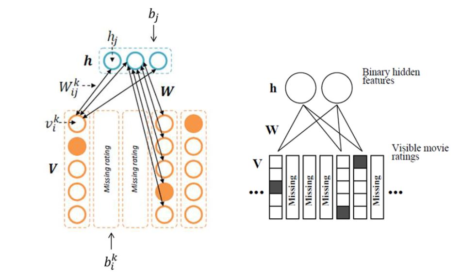
</div>

### 激活函数推导

RBMs本质上是一个概率图模型，故可以基于能量模型研究其概率分布。

通过能量函数，基于能量理论的概率模型定义了以下关于观测v的概率分布：
$$
    P(v) = \frac{e^{-Energy(v)}}{Z}
$$
$$
    Z=\sum_{v,h}e^{-(v,h)}
$$
其中Z为归一化因子。
观测值v和隐藏单元h的联合概率分布
$$
   P(v,h) = \frac{e^{-Energy(v,h)}}{Z}
$$
观测值v的边缘分布为
$$
   P(v) = \sum_{h}\frac{e^{-Energy(v,h)}}{Z}
$$
根据条件概率，
$$
   P(h\vert v) = \frac{e^{-Energy(v,h)}}{\sum_{h}e^{-Energy(v,h)}}
$$
RBMs的能量函数定义为
$$
    Energy(v,h) = -b^{'}v-a^{'}h-h^{'}Wv
$$
$$
    =-\sum_{i=1}^{m}\sum_{j=1}^{F}\sum_{k=1}^{K}W_{ij}^{k}h_{j}v_{i}^{k}+\sum_{i=1}^{m}\log Z_{i}-\sum_{i=1}^{m}\sum_{k=1}^{K}v_{i}^{k}b_{i}^{k}-\sum_{j=1}^{F}h_{j}b_{j}
$$
$$
    P(h\vert v) = \frac{P(v,h)}{P(v)}=\frac{1}{P(v)}\frac{1}{Z}\exp(b^{'}v+a^{'}h+h^{'}Wv)
$$
$$
    =\frac{1}{Z^{'}}\exp(a^{'}h+h^{'}Wv)
$$
其中 $Z^{'}=\frac{1}{P(v)}\frac{1}{Z}\exp(b^{'}v)$。
我们带入rbms模型，可以得到可视层已知的条件下，隐藏层单元被激活的概率
$$
    P(h_{j}=1\vert v) = \frac{P(h_{j}=1\vert v) }{p(h_{j}=1\vert v) +p(h_{j}=0\vert v) }
$$
$$
    =\frac{\exp(b_{j}+\sum_{i=1}^{m}\sum_{k=1}^{K}v_{i}^{k}w_{ij}^{k})}{\exp(0)+\exp(b_{j}+\sum_{i=1}^{m}\sum_{k=1}^{K}v_{i}^{k}w_{ij}^{k})}=\sigma(b_{j}+\sum_{i=1}^{m}\sum_{k=1}^{K}v_{i}^{k}w_{ij}^{k})
$$
同理隐藏层已知的条件下，可视层单元被重新激活的概率
$$
    P(v_{i}^{k}=1\vert h) = \frac{\exp(b_{i}^{k}+\sum_{j=1}^{F}h_{j}w_{ij}^{k})}{\sum_{l=1}^{K}\exp(b_{i}^{l}+\sum_{j=1}^{F}h_{j}w_{ij}^{l})}
$$
其中$\sigma$函数就是我们常说的logistic函数，它的具体表示为$\sigma(x) = \frac{1}{1+e^{-x}}$。

### 抽样过程

&#160; &#160; &#160; &#160;
在已知激活函数的表达式情况下，如何做到将激活概率转化为0，1变量呢？这就需要抽样的方法解决。

&#160; &#160; &#160; &#160;
在编码过程中，已知可见层v，用rbm(W,b,a)网络采样出隐藏层h，这就需要一个抽样函数sample\_h\_given\_v(v,RBM(W,b,a))。

<div  align="center">    
  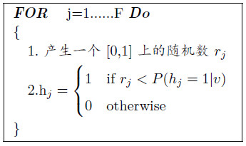
</div>

&#160; &#160; &#160; &#160;
注意到，区间[0,1]上随机产生的$r_{j}$落在子区间$[0, p(h_{j}=1\vert v))$的概率也是$p(h_{j}=1\vert  v)$。既然两个事件的概率是相等的，我们就可以利用后者来模拟前者，若$r_{j}$落在子区间$[0, p(h_{j}=1\vert v))$，则认为$h_{j}$应该取1，否则取0。

<div  align="center">    
  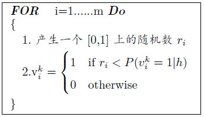
</div>

### 参数训练

&#160; &#160; &#160; &#160;
对于RBM来说，就是要训练出三个权重参数： 连接可视层与隐藏层的权重W，可视层结点的偏移量b，隐藏层结点的偏移量a。

&#160; &#160; &#160; &#160;
因此我们很自然的想法是：期望经过RBM编码和解码后的数据与原始的输入数据尽量接近，这也是最大似然参数估计的思想，即我们的最优化目标函数为：
$$L(W,b,a)=-log(P(v))$$
分别对W,b,a求偏导
$$
    \frac{\partial L}{\partial w_{ij}} = P(h_{j}=1 \vert v)*v_{i} -\sum_{v}P(v)*P(h_{j}=1 \vert v)*v_{i}
$$
$$
    \frac{\partial L}{\partial b_{i}} = v_{i} - \sum_{v}P(v)*v_{i}
$$
$$
     \frac{\partial L}{\partial b_{j}} = P(h_{j}=1 \vert v) -\sum_{v}P(v)*P(h_{j}=1 \vert v)
$$

&#160; &#160; &#160; &#160;
上面三个梯度等式都由两项构成，前一项称为正梯度，后一项称为负梯度，正梯度的计算很简单只依赖于当前输入数据v，负梯度则要考虑所有可能的可视层组合，假设可视层共有n个神经元，那么共有$2^{n}$方的组合，这个公式的时间复杂度显然是机器不能接受，故需要继续优化。

&#160; &#160; &#160; &#160;
训练 RBM 的最大困难在于负梯度的计算， Hinton 教授于 2002 年提出了对比散度的算法，它有效解决了RBM训练速度的难题，也是当前RBM的标准训练算法，对比散度的思想是通过一种合理的采样方法， 以较少的采样样本来近似负梯度的所有组合空间,具体实现过程就是：我们从原始的输入数据$v_{(0)}$出发，经过编码解码得到一个新的可视层输入$v_{(1)}$，这个过程称为一步Gibbs采样，重复这个过程k次，最后得到$v_{(k)}$，这个值$v_{(k)}$就是最后的负梯度近似。

<div  align="center">    
  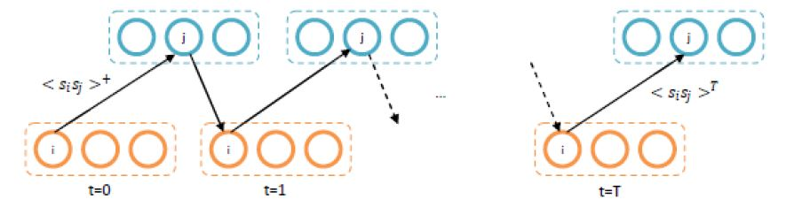
</div>

这样我们将上述求导公式改进,
$$
    \frac{\partial L}{\partial w_{ij}} = P(h_{(0)j}=1 \vert v_{(0)})*v_{(0)i} -P(h_{(k)j}=1 \vert v_{(k)})*v_{(k)i}
$$
$$
    \frac{\partial L}{\partial b_{i}} = v_{(0)i} - v_{(k)i}
$$
$$
     \frac{\partial L}{\partial b_{j}} = P(h_{(0)j}=1 \vert v_{0}) -
     P(h_{(k)j}=1 \vert v_{k})
$$
在现实生活中k取1到10就能取得较好的效果。

&#160; &#160; &#160; &#160;
使用CD算法，各参数的更新法则为：
$$
    \Delta w_{ij} = \gamma_{w}(<v_{i}^{k}h_{j}>^{+} -<v_{i}^{k}h_{j}>^{T})
$$
$$
    \Delta b_{i}^{k}= \gamma_{v}(<v_{i}>^{+} - <v_{i}>^{T})
$$
$$
    \Delta b_{j} = \gamma_{h}(<h_{j}>^{+} - <h_{j}>^{T})
$$
根据如上的更新公式，二元RBMs的更新算法描述如下：

<div  align="center">    
  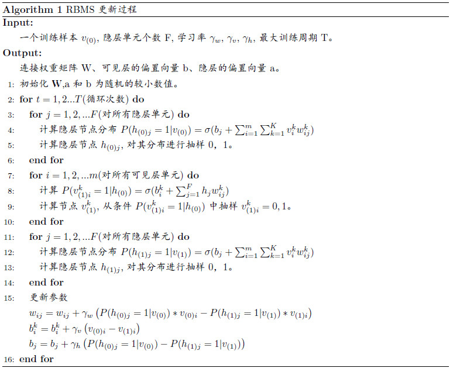
</div>

### 推荐电影
&#160; &#160; &#160; &#160;
假设用户对第q部电影进行预测评分\cite{qi}，我们依然需要用到之前的两个激活函数。
$$
    \hat{p_{j}}=P(h_{j}=1\vert V)=\sigma(b_{j}+\sum_{i=1}^{m}\sum_{k=1}^{K}v_{i}^{k}w_{ij}^{k})
$$
$$
    P(v_{q}^{k})=1\vert \hat{p})=\frac{\exp(b_{q}^{k}+\sum_{j=1}^{F}\hat{P_{j}}w_{ij}^{k})}{\sum_{l=1}^{K}\exp(b_{q}^{l}+\sum_{j=1}^{F}\hat{P_{j}}w_{ij}^{l})}
$$

&#160; &#160; &#160; &#160;
训练好了参数，如何给用户推荐电影呢？然后用RBM reconstruct用户的输入向量，RBM reconstruct 对这k个值（所对应的节点）都有输出。选择用户对这个电影的预测评分就有两种方法：1. 选择k个节点中RBM输出评分概率最大的那个节点作为用户对当前电影的评分；2. 对这k个节点的求期望$E[v_{q}]=\sum_{k=1}^{K}P(v_{q}^{k}=1\vert V)k$。在实践中，这两种方法都可以尝试一下,第二种方法的效果更好一些。

## Conditional RBM

&#160; &#160; &#160; &#160;
上面的模型有一个缺点，忽略了一个信息：用户可能看过这个电影，只不过没有评分而已。这个信息上面的模型没有利用。用户看过电影，也是表示对这个电影的一个喜好。conditional RBM 就是解决这个问题。它引入了一个辅助输入0-1向量，表示用户是否看过这个电影。如果看过，但是没有评分，那么对应的电影的用户输入（missing状态，是随机值）以及对应的权重，也参与训练。作者认为这样会有助于提升模型性能。此时RBM的结构如下：

&#160; &#160; &#160; &#160;
原先每个隐层的分布变为:
$$
     P(h_{j}=1\vert V,r)=\sigma(b_{j}+\sum_{i=1}^{m}\sum_{k=1}^{K}v_{i}^{k}w_{ij}^{k}+\sum_{i=1}^{M}r_{i}D_{ij})
$$
$D_{ij}$是一个权重矩阵，它代表r对h的影响。权重D的学习过程为
$$
     D_{ij}=\gamma_{d}(<h_{j}>^{+}-<h_{j}>^{T})r_{i}
$$
由于参数D与可见层无关，可以作为和b偏置一样的功能，参数更新也一样。

&#160; &#160; &#160; &#160;
而可视层激活函数不发生变化，仍为：
$$
    P(v_{i}^{k}=1\vert h) = \frac{\exp(b_{i}^{k}+\sum_{j=1}^{F}h_{j}w_{ij}^{k})}{\sum_{l=1}^{K}\exp(b_{i}^{l}+\sum_{j=1}^{F}h_{j}w_{ij}^{l})}
$$

<div  align="center">    
  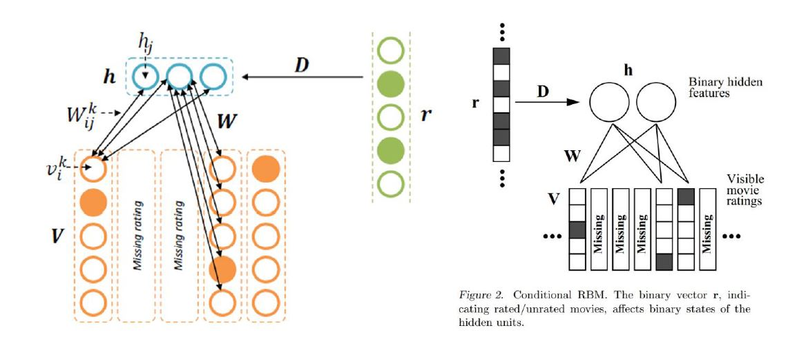
</div>

### RBM vs conditional RBM
&#160; &#160; &#160; &#160;
通过下图RBM与条件RBM的预测效果来看，隐性推荐有着更好的预测效果。观察经过3到5个Gibbs采样，条件RBM的RMSE下降速度明显更快。

<div  align="center">    
  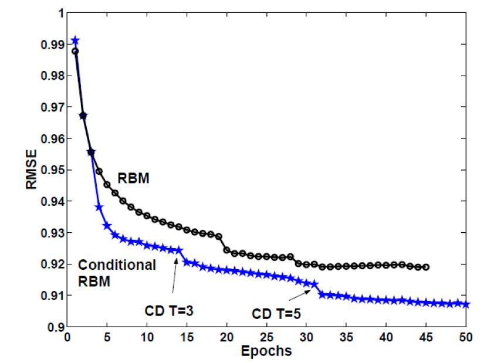
</div>

### 学习速率

&#160; &#160; &#160; &#160;
对于梯度下降中迭代的学习速率的选择，也是有一定的讲究的。若学习速率过大，可能会导致下降过程中出现震荡跳跃越过局部最优点。若学习速率过小，则会导致下降速度过满，浪费时间资源。那较好的学习速率要如何选择呢？通过研究发现，下图中紫色线的RMSE是下降最快的，刚好其学习速率也是上述学习速率中比较中间的。在工业界，选择学习速率需要注意这一点。

<div  align="center">    
  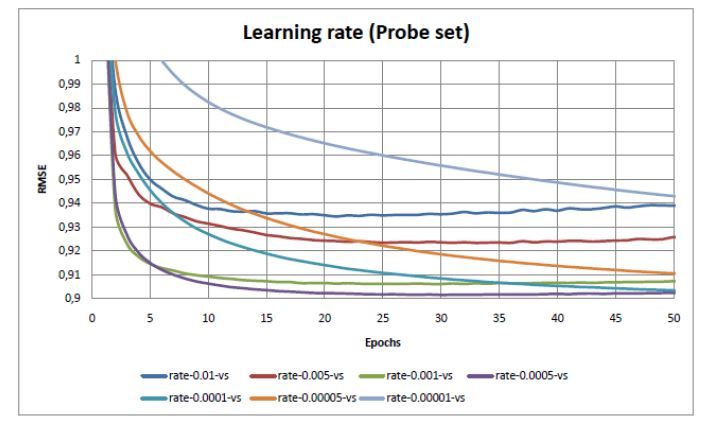
</div>

## RBM的R语言实现
```{r,collapse=TRUE}
### Restricted Boltzmann Machine implementation by isobe

sigmoid <- function(x) 1/(1+exp(-x))

rbm <- function(obs,n_hidden,eta=0.05,
                epsilon=0.05,maxiter=100,
                CD_k=1,reconstruct_trial=10,
                verbose=0) {
  L <- nrow(obs)
  N <- ncol(obs)
  M <- n_hidden
  
  # initial values assinment 
  # cf) Chapter 8 in 
  #   http://www.cs.toronto.edu/~hinton/absps/guideTR.pdf
  pn <- apply(obs,2,function(x) min(0.9,sum(x)/L))
  bn <- log(pn/(1-pn))# visiable bias
  bm <- rep(0,M)#hidden bias
  W <- matrix(rnorm(N*M,0,0.01),N,M)
  
  pv_h <- function(i,h) {
    sigmoid(sum(W[i,]*h)+bn[i])
  }
  ph_v <- function(i,v) {
    sigmoid(sum(W[,i]*v)+bm[i])
  }
  
  gs_step <- function(x,n,p_func) {
    r<-c()
    for (i in 1:n) {
      r<-c(r,rbinom(1,1,p_func(i,x))) #sample
    }
    return(r)
  }
  gs_v <- function(h) gs_step(h,N,pv_h)
  gs_h <- function(v) gs_step(v,M,ph_v)
  
  cd_k <- function(v) {
    v1 <- v
    for (i in 1:CD_k) {
      h1 <- gs_h(v1)
      v1 <- gs_v(h1)
    }
    # R has immutable value and lexical scope,
    #  so we can overwrite locally.
    for (i in 1:N) for (j in 1:M) {
      W[i,j] <- ph_v(j,v)*v[i]-ph_v(j,v1)*v1[i]
    }
    bn <- v-v1
    for (j in 1:M) {
      bm[j] <- ph_v(j,v)-ph_v(j,v1)
    }
    return(list(W=W,bn=bn,bm=bm))
  }
  
  theta_step <- function() {
    W <- matrix(0,N,M)
    bn <- rep(0,N)
    bm <- rep(0,M)
    for (i in 1:L) {
      if (verbose>=3) cat(paste("theta for obs ",i,"\n"))
      d <- cd_k(obs[i,])
      W <- W+d$W
      bn <- bn+d$bn
      bm <- bm+d$bm
    }
    return(list(W=W,bn=bn,bm=bm))
  }
  
  reconstruct <- function(v) gs_v(gs_h(v))
  
  recon_error <- function() {
    r <- 0
    for (t in 1:reconstruct_trial) for (i in 1:L) {
      v <- obs[i,]
      v1 <- reconstruct(v)
      r <- r+sum(abs(v-v1))
    }
    return(r/(N*L*reconstruct_trial))
  }
  
  err <- 1
  count <- 0
  
  cat("init OK. \n")
  
  while (err>epsilon && count<maxiter) {
    if (verbose>=2) cat(paste("step =",count,"\n"))
    d <- theta_step()
    backup <- list(W=W,bn=bn,bm=bm,err=err)
    
    W <- W + eta*d$W
    bn <- bn + eta*d$bn
    bm <- bm + eta*d$bm
    count <- count+1
    err <- recon_error()
    if (backup$err<err) {
      W <- backup$W
      bn <- backup$bn
      bm <- backup$bm
      err <- backup$err
    } else if (verbose) {
      if (verbose>=1) print(paste("step",count,": err=",err))
    }
  }
  
  hidden_prob <- function(v) {
    apply(rbind(1:M),1,function(i) ph_v(i,v))
  }
  
  learn_info=paste("step",count,": err=",err)
  obj <- list(W=W,bn=bn,bm=bm,
              learn_info=learn_info,
              hidden_prob=hidden_prob,
              hidden_sample=gs_h,
              reconstruct=reconstruct)
  class(obj) <- 'rbm'
  return(obj)
}

print.rbm <- function(rbm) {
  cat("edge weights:\n")
  print(rbm$W)
  cat("\nbias for observable nodes:\n")
  print(rbm$bn)
  cat("\nbias for hidden nodes:\n")
  print(rbm$bm)
  cat(paste("\n",rbm$learn_info,"\n",sep=''))
}

rbm_hidden_prob <- function(obj,obs) obj$hidden_prob(obs)
rbm_hidden_sample <- function(obj,obs) obj$hidden_sample(obs)
rbm_reconstruct <- function(obj,obs) obj$reconstruct(obs)


### test program

test <- function() {
  obs <- rbind(c(1,0,1),
               c(1,1,0),
               c(1,0,1),
               c(0,1,1))
  net <- rbm(obs,2,verbose=T,maxiter=3000)
  print(net)
  
  x <- c(1,1,0)
  trial <- 5
  cat("original")
  print(x)
  for (t in 1:trial) {
    cat("reconstructed")
    print(rbm_reconstruct(net,x))
  }
}

test()

```

# SimRank算法

&#160; &#160; &#160; &#160;
关于如何计算相似度，目前主要有两大类方法：（1）基于内容的特定领域度量方法。（2）基于对象间的关系的计算方法。SimRank算法属于第二类方法。

## SimRank算法基本思想

&#160; &#160; &#160; &#160;
SimRank算法是基于图的拓扑结构信息来衡量任意两个对象间相似程度的计算方法。该算法由 MIT 实验室的 Glen Jeh 和 Jennifer Widom教授在2002年首先提出。

&#160; &#160; &#160; &#160;
SimRank算法基于一个简单和直观的图论模型，它把对象和对象之间的关系建模为一个有向图G=（V，E）其中V是有向图的节点集合，代表应用领域中的所有对象；E是有向图的边的集合，表示对象间的关系。并定义每一个节点v的入边关联的邻节点集合为I(v)是节点v的in-neighbors，而节点v的出边关联的邻节点集合 O(v)是节点v的out-neighbors。

<div  align="center">    
  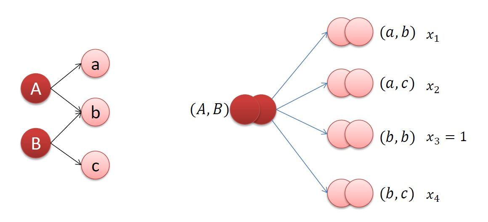
</div>

&#160; &#160; &#160; &#160;
算法的基本思想为如果两个对象被相似的对象所引用，那么这两个对象也相似，其中隐含的初始条件为每个结点与它自身完全相似，而具体计算是通过已有的相似度与对象间的关联计算其他的对象间的相似度。简单的说，如上图(左)所示，就是如果两个对象a，c分别与另外两个对象A，B相关，则如果对象A与B间相似，那么对象a与c也相似；另外如由上图(左)展开得到的上图(右)所示，A与B间的相似度是由$x_{1},x_{2},x_{3},x_{4}$即其旁边括号中两对象间的相似度计算得到。在这里定义如果两个对象完全相似则相似度取值为1，如果完全不相似则相似度取值为0，因此相似度取值必须位于0到1之间。

&#160; &#160; &#160; &#160;
在每一条有向连接上是没有系数的条件下，SimRank算法的一般公式为

$$
s(a,b)=\left\{
\begin{align}
&\quad \quad \quad \quad 1 &  & \text{a = b} \\
&\frac{C}{\vert I(a)\vert \vert I(b)
\vert}\sum_{i=1}^{\vert I(a)\vert}\sum_{j=1}^{\vert I(b)\vert}s\left(I_{i}(a),I_{j}(b)\right)&   &
\text{$a\neq b $且$I(a),I(b) \neq \emptyset$} \\
&\quad \quad \quad \quad  0 &   &  \text{otherwise}
\end{align}
\right. 
$$

&#160; &#160; &#160; &#160;
在上面的公式中$s(a,b)\in[0,1]$，$s(I_{i}(a),I_{j}(b))$ 表示与a入边关联的第i个节点和与b入边关联的第j个节点间的相似度的值。C是一个常量衰减因子，表示对相似度计算的确信度，$C\in(0,1)$，一般取值在0.6到0.8之间\cite{out}。当$a=b$时，即为自己与自己的相似度，其值为1，即完全相关；另外当$a\neq b$且$I(a),I(b)$中存在$\emptyset$时，即a与b中没有关联节点，则令它们的相似度为0，即不相关；此外两点间的相似度从该计算公式可以看出，节点a, b 的相似度取决于所有与a, b 入边关连节点的相似度，是它们的平均值乘衰减因子。
同样不仅可以使用入边关联的点计算相似度，还可以使用出边关联的点计算相似度，由上式可得
$$
     s(A,B)=\frac{C}{\vert O(A)\vert \vert O(B) \vert}\sum_{i=1}^{\vert O(A)\vert}\sum_{j=1}^{\vert O(B)\vert}s\left(O_{i}(A),O_{j}(B)\right)
     \quad \quad \quad \quad \text{$A\neq B $且$O(A),O(B) \neq \emptyset$}
$$

##SimRank算法迭代形式
### 一般迭代公式
&#160; &#160; &#160; &#160;
在使用SimRank算法计算相似度时，我们一般考虑的是针对二部图（二部图是指图中的节点可以分两个子集，任意一条边关联的两个节点分别来自于这两个子集）模型一个子集中的点进行计算的，但是考虑到另一个子集中的点间的相似度也不便于得到，这里利用SimRank出边关联与入边关联都可以计算相似度的特性，利用二部图左右两边不断互推进行迭代计算来避免子集中点的相似度的直接计算。

&#160; &#160; &#160; &#160;
使用$R_{k}(a,b)$表示第k次迭代节点a,b间的相似度，定义初始迭代每个节点只与其自身相似，则迭代的初始化为
$$R_{0}(a,b)=
\begin{cases}
0& \text{$a \neq b$}\\
1& \text{a = b}
\end{cases}$$

&#160; &#160; &#160; &#160;
第k+1次迭代得到的相似度可以由第k次迭代得到的相似度得到,
$$
R_{k+1}(a,b)=
\begin{cases}
\frac{C}{\vert I(a)\vert \vert I(b)
\vert}\sum_{i=1}^{\vert I(a)\vert}\sum_{j=1}^{\vert I(b)\vert}R_{k}\left(I_{i}(a),I_{j}(b)\right)& \text{$a \neq b$}\\
\quad \quad \quad \quad \quad \quad \quad \quad  1& \text{a = b}
\end{cases}
$$

&#160; &#160; &#160; &#160;
也就是说在每次迭代中我们使用前一次得到的节点a,b邻居间的相似度来计算节点a,b间的相似度。以上迭代过程保证了$R_{k} (a,b)$是一个单调非减函数，并且收敛到$s(a,b)$。并且在实验中可以发现$R_{k} (a,b)$收敛的很快，k不需要设的很大。

&#160; &#160; &#160; &#160;
接下来看这个算法的时间空间要求，所需空间复杂度只是$O(n^{2} )$用于储存结果$R_{k}$,定义d为所有的节点对得到的$|I(a)||I(b)|$的值的平均值，则时间复杂度为$O(kdn^{2} )$。

### SimRank迭代示例
&#160; &#160; &#160; &#160;
如图c所示，红色与蓝色的点分别属于二部图的两个子集，中间的的蓝色有向线段表示节点间的关联性。

<div  align="center">    
  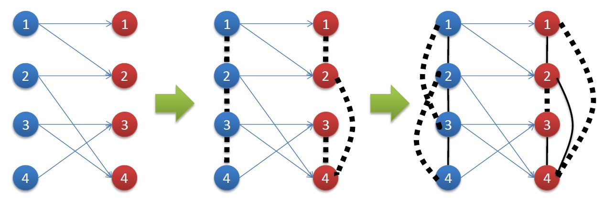
</div>


   1. 迭代初始化，定义每个节点只与自身相似，与其他节点均不相似。
   2. 第一次迭代，在初始化定义的相似度条件下使用(4.3)式分别计算两个子集中点之间的相似度，比如蓝色的点1与点2均与红色的点2相连，则两点相似，且相似度为1/4。
  3.  第二次迭代，在第一次迭代得到的相似度结果下使用(4.3)式分别计算两个子集中点之间的相似度，对两点间的相似度进行更新，比如蓝色的点1与红色的点2相连，蓝色的点3和红色的点4相连，而红色的点2与点4相似，则蓝色的点1与点3相似。
  4. 这样一直迭代更新下去，理论上当迭代次数k趋向于无穷的时候便可得到子集中每个点之间的实际相似度。但是由于收敛的够快，一般在5次左右即可得到和实际相似度非常接近的解。

### SimRank矩阵迭代形式
&#160; &#160; &#160; &#160;
考虑到上面的迭代公式难以展开计算，考虑使用矩阵形式代替每项展开的形式。

&#160; &#160; &#160; &#160;
首先确定迭代初始化的矩阵形式，由于每个节点只与自身相似，即相似度矩阵只有对角线元素为1，其余为0，是单位阵，于是有
$$ R_{0}=I_{n}$$

&#160; &#160; &#160; &#160;
而进一步对k+1步的迭代计算公式进行简单的推导
\begin{align}
    R_{k+1} = &\frac{C}{\vert I(a)\vert \vert I(b) \vert}\sum_{i=1}^{\vert I(a)\vert}\sum_{j=1}^{\vert I(b)\vert}R_{k}\left(I_{i}(a),I_{j}(b)\right)\\
    =&\frac{C}{\vert I(a)\vert \vert I(b) \vert}\sum_{i=1}^{ N}\sum_{j=1}^{N}p_{ia}R_{k}\left(I_{i}(a),I_{j}(b)\right)p_{jb}\\
    =&C\sum_{i=1}^{N}\sum_{j=1}^{N}\frac{p_{ia}}{\sum_{q=1}^{N}p_{qa}}R_{k}\left(I_{i}(a),I_{j}(b)\right)\frac{p_{jb}}{\sum_{q=1}^{N}p_{qb}}
\end{align}

&#160; &#160; &#160; &#160;
上式中$N=|I(a)\bigcup(b)|$表示集合I(a),I(b)中的所有元素，节点i与节点a间存在连线，时，$p_{ia}=1$，否则$p_{ia}=0$，其余带两个下标的p是相同的定义。

&#160; &#160; &#160; &#160;
因此以上推导中第一步将累加从计算分别来自两个相关集合的节点间的相似度的和改
为了计算两个相关集合中每个节点间的相似度的和，而为了保证等式成立，添加了两个判别因子$p_{ia}$与$p_{jb}$，用于确定这些节点是否与需要计算相似度的两个节点分别相连。而推导的第二步是将累加外面的系数除进累加的每一项，其作用是对判别因子进行归一化处理。

&#160; &#160; &#160; &#160;
将上式列为矩阵形式有
$$ R_{k+1}(a,b) = CWR_{k}W^{T}$$

&#160; &#160; &#160; &#160;
式中W是转移概率矩阵，其每一行的和均为1，而每一个非零元素的值为1除以该行非零元素的个数。但是由于规定当$a=b$，时$R_{k+1} (a,b)=1$，而上述公式计算出来的相似度矩阵的对角线元素不等于1，因此要对上公式进行改进，使对角线元素均为1，则
$$ R_{k+1}(a,b) = CWR_{k}W^{T}+I-Diag(diag(CWR_{k}W^{T}))$$

&#160; &#160; &#160; &#160;
其中$diag(CWR_{k} W^{T })$指取矩阵$CWR_{k} W^{T}$的对角线元素并构成一个向量，而$Diag(diag(CWR_{k} W^{T} ))$则是以得到的向量构成对角矩阵。补充的两项使相似度矩阵的对角线元素变成了1，并不改变矩阵其他位置元素的值。

&#160; &#160; &#160; &#160;
上面的推导整理后得到完整的SimRank算法矩阵迭代形式为
\begin{align}
    R_{0}=I_{n}& \\
R_{k+1}(a,b) = CWR_{k}W^{T}+I- &Diag(diag(CWR_{k}W^{T}))
\end{align}

## SimRank++算法
&#160; &#160; &#160; &#160;
由于SimRank算法无法处理关联边上方具有权重的模型，因此需要对其进行改进，使其在计算中可以代入权重，以增加结果的准确度。

&#160; &#160; &#160; &#160;
这里给出了一种改进算法SimRank++算法，该算法在SimRank算法的基础上进行了两点改变：第一点是对于边的归一化权重，考虑了边的权值，不再比较笼统取关联的边数分之一；第二点是添加对共同相连边的考虑，因为两个对象间共同相连的边越多，则意味着两个节点的相似度会越高。

### SimRank++算法一般公式
&#160; &#160; &#160; &#160;
该公式是在原始SimRank算法的基础上添加了一个证据因子和两个权重函数，这里定义证据因子为
$$
     evidence(a,b)=\sum_{i=1}^{\vert I(a) \bigcap I(b)\vert}\frac{1}{2^{i}}
$$
&#160; &#160; &#160; &#160;
$\vert I(a) \bigcap I(b)\vert$表示节点a与节点b间共同相连边的数量。上式的值随着共同相连边的数量的增加而增大，而且逐渐趋向于1。而两个权重函数实为对模型中的关联边上的权重进行归一化处理，其具体表示为
$$
     W(a,I_{i}(a)) = \frac{ w(a,I_{i}(a))}{\sum_{j=1}^{\vert I(a)\vert} w(a,I_{i}(a))}
$$
&#160; &#160; &#160; &#160;
上式中$w(a,I_{i}(a))$为点a到另一个子集中与其相连的第i个点的连线上的权值。

&#160; &#160; &#160; &#160;
将以上证据因子和权重函数加入即可得到当$a\neq b$时
$$
     s(a,b)=evidence(a,b)\cdot C\sum_{i=1}^{\vert I(a) \vert}\sum_{j=1}^{\vert I(b) \vert} W(a,I_{i}(a)) W(b,I_{j}(b))s(I_{i}(a),I_{j}(b))
$$

&#160; &#160; &#160; &#160;   
而当$a=b$时，仍取$s(a,b)=1$。上式中C仍然表示衰减因子，即从本质上算法的基本思想并没有改变。

### SimRank++算法的矩阵迭代公式
&#160; &#160; &#160; &#160;
与前面的SimRank算法一样，改进后的算法同样面临着另一子集中节点间的相似度不易得到的问题和迭代形式展开不便的问题，于是这里同样引入矩阵迭代形式的算法。

&#160; &#160; &#160; &#160;
首先由于SimRank++算法不改变每个点与自身相似度为1，不相似的两点间相似度为0这个条件，于是迭代的初始化的矩阵形式与前面的SimRank算法矩阵迭代形式相同为
$$R_{0}=I_{n}$$

&#160; &#160; &#160; &#160;
而考虑到权重函数在每一项累加中都有出现，而证据因子则出现在累加项以外，因此这里将通过改变原始算法矩阵迭代公式中的转移概率矩阵W来实现添加权重函数，而证据因子则通过点乘的方法乘在迭代结束得到的相似度矩阵前方。设改变后的转移概率矩阵为P，于是我们可以得到
$$R_{k+1} = CPR_{k}P^{T}+I- Diag(diag(CPR_{k}P^{T}))$$

&#160; &#160; &#160; &#160;
设迭代结束后得到的相似度矩阵为$R_{m}$，而证据值构成的矩阵为V，则最终所得相似度矩阵为
$$S =V.*R_{m}$$

&#160; &#160; &#160; &#160;
上面的定义中改变后的转移概率矩阵P的形式为每一行元素之和为1，而元素的值为节点间连线上的权值的归一化结果，比如令$P=(p_{ij} )_{n×n}$，则$p_{ij}$表示第i个节点到第j个节点的连线上的权值归一化。而V的每个元素对应于相似度矩阵R中的每一个元素。

## SimRank++算法应用于个性化推荐系统
&#160; &#160; &#160; &#160;
这个算法是用于计算用户间的相似度的，因此，其在个性化推荐系统中是用于相似度推荐的。因此我们要通过用户与电影间的关系进而找到用户与用户间的关系，然后通过其他用户向目标用户推荐相似的电影。

&#160; &#160; &#160; &#160;
首先由于SimRank++算法是图结构的算法，这里需要将用户与电影间的关系变为图结构模型。如果一个用户看过一部电影那么则在用户与电影间添加一条由用户指向电影的有向线段，并将用户对这部电影的评分$r(r\in[0,5])$除以5后得到的值写在连线上方作为权重，这里如果没有进行评分可以使用前面讲到的两个评分算法对看过但是没有进行评分的电影的评分进行预测。

&#160; &#160; &#160; &#160;
然后将上一步得到的图模型代入SimRank++的矩阵迭代形式的算法中这里需要确定一个常量衰减因子C的值，一般在0.6到0.8之间。经过反复迭代得到相似度矩阵。

&#160; &#160; &#160; &#160;
最后查看完成的矩阵，然后从k个最接近的邻居中抽取评级历史记录，并使用该数据通过计算与筛选，得到提供给当前用户的相似度推荐结果。

